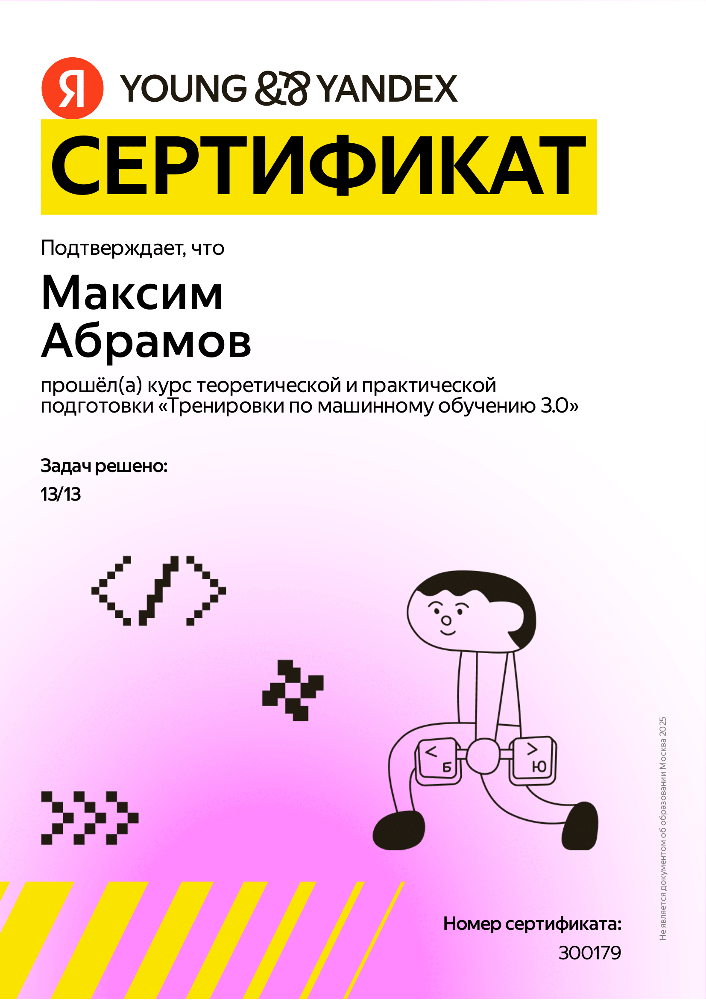

# Яндекс тренировки по ML 3.0
1. Классификация изображений 
- [Ссылка на контест](https://contest.yandex.ru/contest/75228/enter/)
- [Решение](https://github.com/Boblabled/Yandex_courses/tree/master/ML_Trainings/3.0/hw01_classification)
2. Histogram of oriented gradient (HOG)
- [Ссылка на контест](https://contest.yandex.ru/contest/75229/enter/)
- [Решение](https://github.com/Boblabled/Yandex_courses/tree/master/ML_Trainings/3.0/hw02_edge_detection)
3. Homography mapping
- [Ссылка на контест](https://contest.yandex.ru/contest/75230/enter/)
- [Решение](https://github.com/Boblabled/Yandex_courses/blob/master/ML_Trainings/3.0/hw03_panorama)
4. Переобучение
- [Ссылка на контест](https://contest.yandex.ru/contest/75231/enter/)
- [Решение](https://github.com/Boblabled/Yandex_courses/tree/master/ML_Trainings/3.0/hw04_overfitting)
5. Feature engineering
- [Ссылка на контест](https://contest.yandex.ru/contest/75232/enter/)
- [Решение](https://github.com/Boblabled/Yandex_courses/tree/master/ML_Trainings/3.0/hw05_neo-tokio)
6. Восстановление данных
- [Ссылка на контест](https://contest.yandex.ru/contest/75233/enter/)
- [Решение](https://github.com/Boblabled/Yandex_courses/tree/master/ML_Trainings/3.0/hw06)
7. Pytorch implementation
- [Ссылка на контест](https://contest.yandex.ru/contest/75234/enter/)
- [Решение](https://github.com/Boblabled/Yandex_courses/tree/master/ML_Trainings/3.0/hw07_nn_from_scratch)

