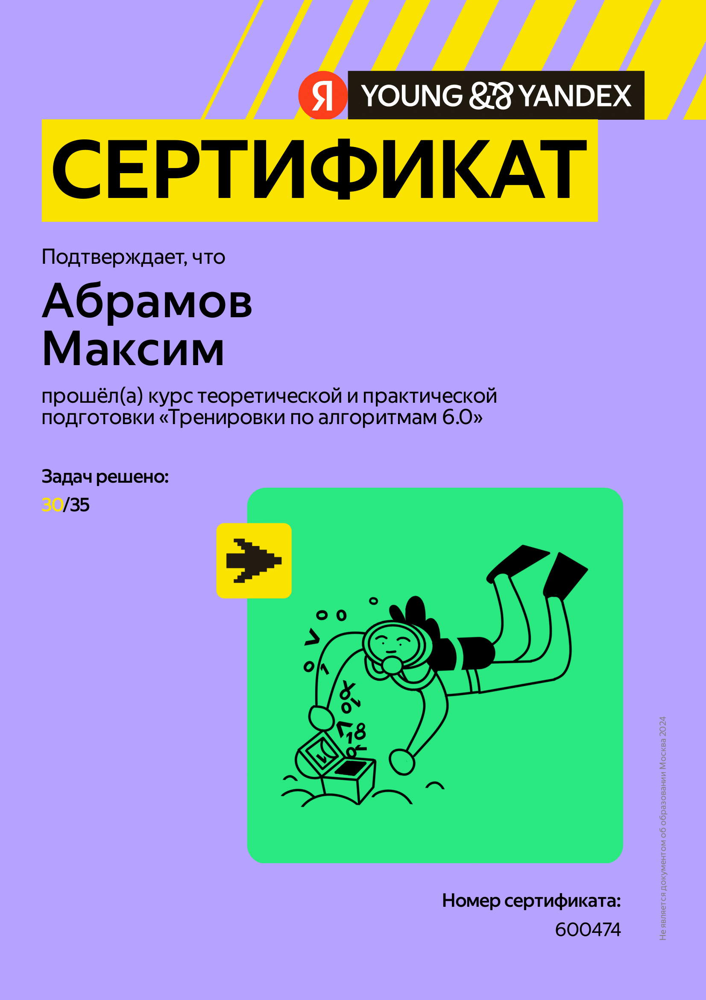

# Яндекс тренировки по алгоритмам 6.0
1. Тестирование
- [Ссылка на контест](https://contest.yandex.ru/contest/66792/enter/)
- [Решение](https://github.com/Boblabled/Yandex_courses/tree/master/Trainings/6.0/%D0%94%D0%97_%E2%84%961)
2. Префиксные суммы и два указател
- [Ссылка на контест](https://contest.yandex.ru/contest/66793/enter/)
- [Решение](https://github.com/Boblabled/Yandex_courses/tree/master/Trainings/6.0/%D0%94%D0%97_%E2%84%962)
3. Стеки, очереди, деки
- [Ссылка на контест](https://contest.yandex.ru/contest/66794/enter/)
- [Решение](https://github.com/Boblabled/Yandex_courses/tree/master/Trainings/6.0/%D0%94%D0%97_%E2%84%963)
4. Деревья, представления и обходы
- [Ссылка на контест](https://contest.yandex.ru/contest/66795/enter/)
- [Решение](https://github.com/Boblabled/Yandex_courses/tree/master/Trainings/6.0/%D0%94%D0%97_%E2%84%964)

